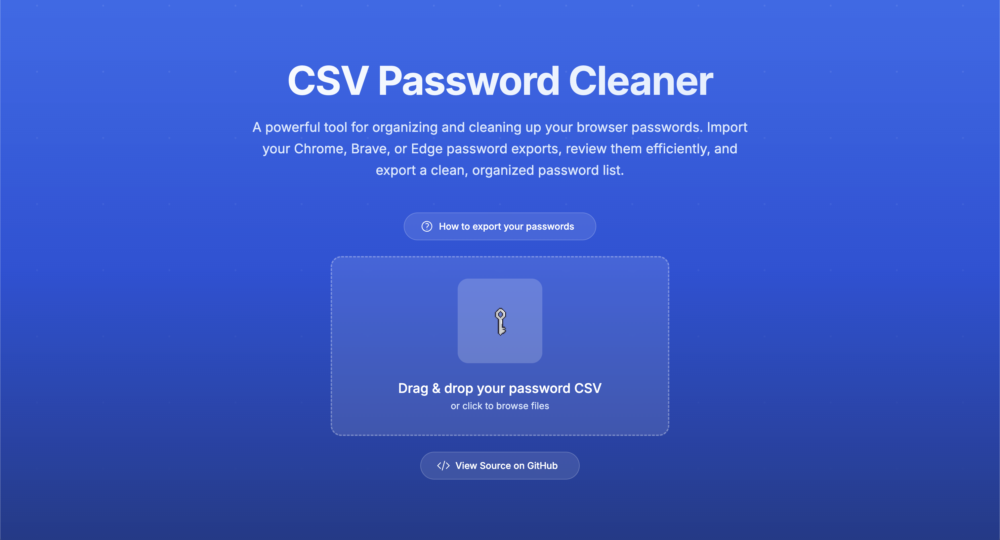
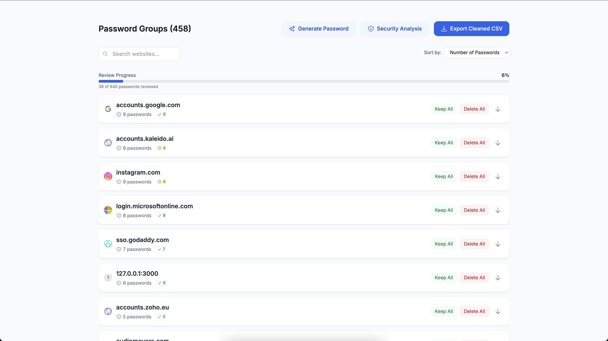
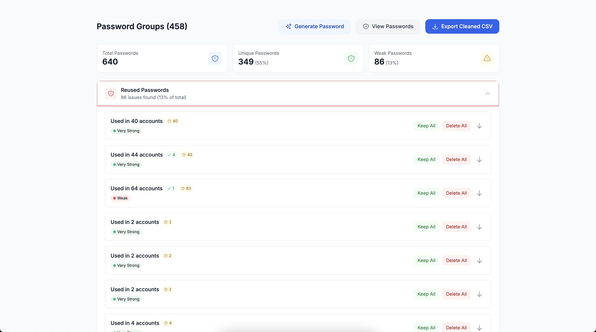
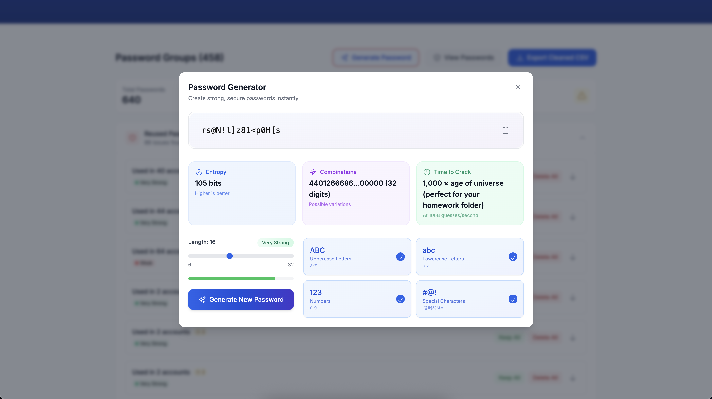

# Password Cleaner

A secure, client-side web application for cleaning up and managing password exports from Chrome, Brave, Edge and most other Chromium browsers.






## Features

### 🛡️ Zero-Trust Security
- **100% Client-Side**: Your passwords never leave your browser
- **No Storage**: Everything stays in memory, cleared on close
- **Auto-Protection**: Passwords auto-hide after 30 seconds
- **Local Processing**: Zero server communication

### 🧹 Smart Password Management
- **Instant Organization**: Auto-groups by domain with smart categorization
- **Bulk Actions**: Process entire domains with one click
- **Quick Filters**: Sort by strength, usage, or status
- **Smart Search**: Find any password in seconds

### 📊 Advanced Security Analysis
- **Real-time Strength Metrics**: Entropy, combinations, crack time
- **Risk Assessment**: Identifies weak and reused passwords
- **Visual Dashboard**: Clear security insights at a glance
- **Smart Recommendations**: Helps you make informed decisions

### ⚡ Modern Password Generator
- **Smart Generation**: Creates strong, memorable passwords
- **Custom Options**: Length, character sets, complexity
- **Strength Visualization**: Real-time security feedback
- **Time-to-Crack**: With witty, astronomical comparisons

### 💫 Sleek User Experience
- **Modern UI**: Clean design with smooth animations
- **Smart Defaults**: Optimized for efficiency
- **Visual Feedback**: Clear status indicators
- **Progress Tracking**: Never lose your place

## Quick Start

```bash
git clone https://github.com/yourusername/pass-cleaner.git
cd pass-cleaner
npm install
npm run dev
```

## How It Works

1. **Export**: Get your passwords from Chrome/Brave (chrome://settings/passwords → Export)
2. **Upload**: Drag & drop your CSV file
3. **Review**: Sort, filter, and process passwords efficiently
4. **Export**: Download your cleaned password list

## Security Guarantee

- ✓ No server communication
- ✓ No data storage
- ✓ Memory cleared on close
- ✓ Auto-hiding passwords
- ✓ Client-side only

## License

MIT License - See LICENSE file for details.
